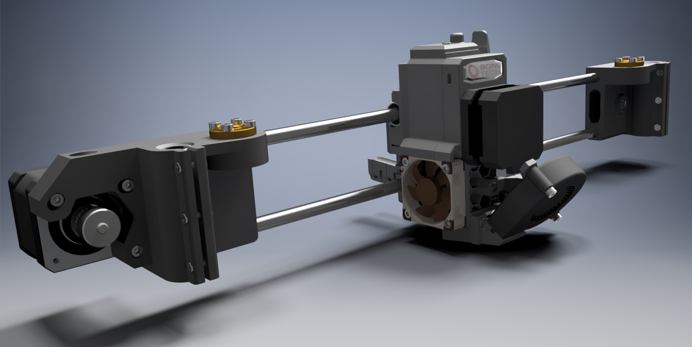

# MendelMax 1.5 X Axis Assembly

## Description
The X Axis assembly for the MendelMax 1.5 3D Printer.

## Versions:
- v2: Corrected the rod holes alignment on idler and motor end; Added screws on idler to set the correct length on rods (if they are shorter) or to tension the assembly more than on the motor side;
- v1: Initial build of the assembly.

## Assembly
1. X End Motor and Idler:
	- created by prusa and edited to fit mendelmax 3d printer;
	- distance between bearings and trapezoidal nut increased to 30mm;
	- added screws to tighten the bearings.
1. Extruder:
	- created by prusa and modified by bondtech to fit bmg extruder (support can be found at [bondtech github](https://github.com/BondtechAB/Bondtech_Prusa_i3));
	- changed the filament sensor to Duet3D filament monitor;
	- changed P.I.N.D.A. probe to SN04-N Inductive Proximity Sensor (5mm);
	- changed square nuts and threaded inserts to hexagonal nuts (M3);
	- modified the turbine fan mount to be stronger and have ties support.

## License
The MIT License.
